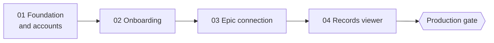

# Dashboard Roadmap (spec for plans 01–04)

This is the spec the four dashboard plans implement. Read it before any plan; every plan treats its **Decisions**, **Security rules** and **Production gate** as global constraints.

**Goal:** a signed-in patient can create an account, finish a short onboarding, connect an Epic health system through SMART on FHIR, and read their own records inside the Wild Hearts Health dashboard.

**Status of the repo when this starts:** the Nightlight landing page (PR `landing/nightlight`) is merged. No auth, database or Epic code exists. The design system is `docs/creative-direction.md`; its tokens live in `src/app/globals.css`.

## Decisions

| Area | Decision | Why |
| --- | --- | --- |
| App accounts | **Better Auth 1.7**, self-hosted; email + password with required email verification and password reset | Identities stay in our own Postgres; no third party holds patient identities |
| Database | **Postgres on Neon**, provisioned through the Vercel Marketplace; **Drizzle ORM**; migrations in `drizzle/` | Plugs into the existing Vercel project, with preview branches per PR |
| Records | **Live fetch.** FHIR resources are fetched from Epic per request and never written to our database | No patient records at rest in V1; storage and cross-system merging come after the production gate |
| Epic auth | **SMART App Launch, standalone patient launch**, authorization code + PKCE (S256), **confidential client using `private_key_jwt`** (RS384) with a JWK Set URL served by the app | Epic only issues refresh tokens to confidential clients; JWT auth avoids a shared secret and allows key rotation |
| Environments | `EPIC_ENVIRONMENT=sandbox` everywhere until the production gate passes; the org picker then only offers Epic's sandbox | Real patients cannot connect by accident |
| Sign-ups | `SIGNUPS_ENABLED=true` in development and preview, `false` in production until the gate; the sign-up page shows an early-access note when off | The landing page still says "early access", and production must not collect accounts before the gate |
| Email | Resend HTTP API for verification and reset links only; console output in development | Emails contain links, never health information |
| Tests | **Vitest 5** for units; **PGlite** (in-process Postgres) for repository tests; manual sandbox walkthroughs for the Epic round trip | Fast tests without a network database |

## Sequence

Each plan ends with a shippable PR. Plans 01 and 02 can deploy to preview immediately; 03 needs the Epic app registration below.

| Plan | File | Delivers |
| --- | --- | --- |
| 01 | `2026-09-23-dashboard-01-foundation-and-accounts.md` | Test tooling, env validation, Neon + Drizzle, Better Auth, sign-up / sign-in / verify / reset pages, protected `/app` shell, "Sign in" in the landing nav |
| 02 | `2026-09-23-dashboard-02-onboarding.md` | `profile` table, three-step onboarding (name, acknowledgements, connect), onboarding gate on `/app` |
| 03 | `2026-09-23-dashboard-03-epic-connection.md` | Token encryption, PKCE, org directory, SMART discovery, JWT client auth + JWKS route, authorize and callback routes, encrypted `epic_connection` table, token refresh, connections page |
| 04 | `2026-09-23-dashboard-04-records-viewer.md` | FHIR search client, resource normalizers, records aggregator, dashboard home timeline, category pages |

## Route map

| Route | Kind | Plan |
| --- | --- | --- |
| `/sign-in`, `/sign-up`, `/check-email`, `/forgot-password`, `/reset-password` | Pages in `src/app/(auth)/` | 01 |
| `/api/auth/[...all]` | Better Auth handler | 01 |
| `/app` | Dashboard home (protected) | 01 shell, 04 content |
| `/app/onboarding` | Onboarding flow | 02 |
| `/app/connections` | Connect and disconnect health systems | 03 |
| `/app/records/[category]` | One category of records | 04 |
| `/api/epic/authorize` | Starts the SMART launch | 03 |
| `/api/epic/callback` | SMART redirect URI | 03 |
| `/api/epic/jwks` | Public JWK Set registered with Epic | 03 |
| `/api/health` | Unchanged | — |

## Data model

| Table | Owner | Holds |
| --- | --- | --- |
| `user`, `session`, `account`, `verification` | Better Auth (generated) | Accounts, sessions, password hashes, verification tokens |
| `profile` | Plan 02 | Preferred name, acknowledgement version and time, onboarding completion |
| `epic_connection` | Plan 03 | One row per user per Epic organization: FHIR base URL, org name, **sealed** patient FHIR ID, **sealed** access and refresh tokens, expiry, granted scopes |

No table stores FHIR resources in V1.

## Security rules

- Epic tokens and the patient's FHIR ID are encrypted with AES-256-GCM (`TOKEN_ENCRYPTION_KEY`) before they reach the database, and decrypted only inside server code.
- OAuth `state` and the PKCE verifier travel in a sealed, `httpOnly`, `SameSite=Lax` cookie scoped to `/api/epic`, valid for 10 minutes.
- `/api/epic/authorize` only accepts FHIR base URLs from the org directory (an allowlist); anything else is a 400.
- FHIR paging only follows `next` links on the same origin as the connection's FHIR base URL.
- Never log, return to the client, or put in a URL: tokens, patient IDs, FHIR resources, email addresses. Server errors log a category and status code only.
- Modules that touch secrets import `server-only`, except modules the Better Auth CLI loads (`src/lib/env.ts`, `src/lib/db/*`, `src/lib/auth.ts`), because `server-only` throws outside Next's server runtime.
- `AGENTS.md` still applies: no HIPAA, Epic-approval or clinical-accuracy claims anywhere in the UI.

## Epic app registration (before plan 03, Task 9)

1. Create the app at [fhir.epic.com](https://fhir.epic.com) → Build Apps. Audience: **Patients**. FHIR version: **R4**. It is a **confidential** client using **JWT** authentication.
2. Select the read APIs: Patient, Condition (Problems), MedicationRequest, AllergyIntolerance, Observation (Labs), Immunization, Encounter. Enable refresh tokens (`offline_access`).
3. Register redirect URIs for each environment: `http://localhost:3000/api/epic/callback`, the Vercel preview domain, and the production domain, each ending in `/api/epic/callback`.
4. Register the **non-production JWK Set URL** as `https://<preview-or-staging-domain>/api/epic/jwks`. Epic caches keys for up to 29 hours; rotate by adding the new key before removing the old one.
5. Copy the non-production client ID into `EPIC_CLIENT_ID` for development and preview. Sandbox changes can take up to an hour to sync.
6. Sandbox test patients and their MyChart logins are listed on Epic's "Sandbox Test Data" page; plan 04's walkthrough uses one of them.

## Production gate

Nothing flips `EPIC_ENVIRONMENT=production` or `SIGNUPS_ENABLED=true` until every item is done and documented. This list comes from the README and `AGENTS.md`.

- [ ] Reviewed threat model covering auth, token storage, the SMART flow and logging
- [ ] Privacy policy and terms published; onboarding acknowledgements updated to reference them (bump `CONSENT_VERSION`)
- [ ] Business associate agreement in place with Cloudflare, which hosts the app, database, background jobs and email since the Cloudflare migration (and with any other vendor that can see patient data)
- [ ] MFA or passkeys available to every account (Better Auth `twoFactor` / `passkey` plugins)
- [ ] Audit log of connection events (connect, refresh failure, disconnect) without PHI
- [ ] Data retention and account deletion design, including deleting `epic_connection` rows
- [ ] Incident response plan
- [ ] Epic production client ID, production JWK Set URL, production redirect URIs
- [ ] Evidence-backed HIPAA and legal assessment
- [ ] External security review of the Epic flow
- [ ] Landing-page promises true in the product: disconnect anytime (plan 03), only what's needed (scopes listed on the connections page), answers cite sources and duplicates merged (not in V1: remove those lines from the landing page or build them first)

## Out of scope for V1

Storing records, merging across health systems, AI answers, specialist summaries, non-Epic sources, a light theme, native apps.

## Open questions

- Production domain (needed for redirect URIs, the JWK Set URL and `metadataBase`).
- Which sender address verification emails come from (`EMAIL_FROM`).
- Whether invited early-access testers should use the sandbox only, or wait for production.
