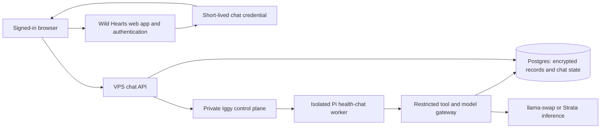

# Wild Hearts personal health chat and Iggy execution plan

Historical plan: the VPS database/signing-key topology below is superseded by the [web-owned boundary](../specs/2026-10-07-web-owned-chat-security-boundary.md) and [rollout guide](2026-10-08-web-owned-chat-rollout.md).

**Date:** October 4, 2026

**Status:** Architecture proposal from the planning discussion. No chat implementation, Iggy changes, or deployment has been completed.

Build an authenticated chat experience that answers questions about a person's stored health records, saves personal summaries, and preserves conversations and the tools used to produce each answer. Run the agent backend on a VPS to keep hosting portable and avoid making Vercel compute a long-term dependency.

Use Pi's embeddable agent core as the preferred starting point. Evolve Iggy into a shared container runner with separate coding and health-chat profiles. Wild Hearts owns authentication, health-data access, encryption, and conversation storage; Iggy owns execution and isolation.

## Requirements and proposed choices

| Area | Requirement or proposed choice |
| --- | --- |
| Experience | Text-only conversations about the signed-in person's existing records. History and saved summaries remain available later. |
| Identity | Derive identity from authentication. The model cannot select a user or grant itself access. |
| Tools | A small allowlist of record lookup, calculation, and summary tools. No arbitrary SQL, shell, filesystem, or internet-fetch tools. |
| Inference | User-hosted llama.cpp through llama-swap, or Strata for Qwen Flash Next. Test the exact server, model, quantization, and template combination. |
| Harness | Prefer `@earendil-works/pi-agent-core` and `@earendil-works/pi-ai`; select and pin a release after a compatibility prototype. |
| Hosting | A standard Node.js service and Docker deployment on the VPS. The existing website can remain on Vercel temporarily and move later. |
| Execution | Iggy is the proposed reusable runner for disposable containers. Whether the initial release uses a container per run or a longer-lived worker remains open. |
| Storage | Existing Postgres/Neon and Drizzle, with encrypted conversation contents, tool context, and summaries. |
| Background work | Prefer a portable Postgres-backed job mechanism if runs must survive browser disconnects. Exact queue and recovery implementation remain open. |

Pi is an MIT-licensed toolkit, not a required hosted service. AI SDK is another portable library option, but Pi core is the preferred prototype choice after the discussion. Neither library requires Vercel hosting.

## Architecture and responsibilities

The browser connects directly to the VPS chat API for streaming. Avoid routing a long-running chat stream through a Vercel function. The existing web app authenticates the person and can issue a short-lived credential with a restricted audience and scope. The VPS validates it, checks conversation ownership, and creates a run. Specify expiry, renewal, revocation, and origin checks during implementation; a credential grants no access to Iggy's container-management API.

The trusted chat service gives the worker a capability bound to one user, conversation, and run. The gateway derives that identity from the capability and validates every tool operation. Do not accept a model-supplied user ID. The worker receives no database credentials, record encryption keys, Epic tokens, or broad service credentials.

The gateway forwards model requests only to the configured inference service and executes approved tools against owned data. The model sees selected context, never database access or decryption keys. Treat prompts, retrieved context, and inference output as sensitive wherever they pass through the system.

Pi manages the model/tool loop, context preparation, execution events, and cancellation. Wild Hearts supplies domain tools, run budgets, citations, storage, and recovery. Create independent agent state for each run and restore only that conversation's authorized context; never share a mutable agent instance across people.

## User isolation and encryption

The current `src/lib/db/rls.ts` and migration `0006` intentionally permit access when `app.user_id` is absent. Change the effective policies to deny access without a valid user context before exposing records to chat. Adding another permissive policy does not remove an existing permissive fallback. Plan an explicit background-job access strategy and a backward-compatible rollout.

- Use `asUser(db, userId, ...)` for user operations, with explicit ownership filters as another layer.
- Use a narrowly privileged application database role without `SUPERUSER` or `BYPASSRLS`.
- Protect every new personal-data table with RLS and add it to `RLS_TABLES`.
- Enforce consistent ownership in relationships between conversations, messages, runs, summaries, and evidence rows.
- Recheck ownership for record IDs, notes, source IDs, FHIR references, conversation history, and traces. IDs locate objects; they do not authorize access.
- Reuse the existing per-user envelope encryption pattern, binding ciphertext to its user, table, field, and row.
- Keep network/model calls outside database transactions.

The user interface receives only authorized display content and answers. Credentials, encryption keys, OAuth codes, and unnecessary raw identifiers remain server-only. No sensitive content goes into ordinary logs, analytics, error reports, URLs, or external traces. Do not claim HIPAA compliance, Epic approval, or clinical accuracy without documented evidence.

## Restricted tools and record retrieval

Initial tool candidates:

| Tool | Purpose |
| --- | --- |
| `get_data_coverage` | Report available sources, record categories, last sync, and known import gaps. |
| `find_records` | Bounded, paginated lookup by supported type, date, source, and clinical criteria. |
| `read_records` | Read selected fields from owned records and supply evidence handles. |
| `read_stored_note` | Read text already stored for an owned note. |
| `calculate_lab_trend` | Use deterministic code to compare retrieved, compatible measurements. |
| `find_saved_summaries` | Retrieve relevant summaries belonging to this person. |
| `save_summary` | Persist a validated summary and its supporting evidence idempotently. |

Validate arguments at the tool boundary, using Pi's schema requirements and the existing Zod domain validators where appropriate. Enforce allowed types, page sizes, time and token budgets, and maximum tool rounds. Start with sequential tools. Execute only complete, validated tool calls; partial streamed arguments never trigger actions.

FHIR payloads and normalized summaries are encrypted today. Postgres can filter existing plaintext metadata such as type, category, date, and source, but cannot search inside encrypted payloads. Initially retrieve bounded candidate sets, decrypt on the trusted server, and apply clinical matching there. Supply compact evidence objects instead of entire FHIR bundles.

For a broad question, cover all relevant pages within the retrieval budget or disclose incomplete coverage. Do not present a sampled result as complete. Default to current, nonremoved records while preserving exact source versions for citations. Use deterministic code for calculations, units, dates, and ordering, including duplicate and amended records.

The existing `loadNoteFor` can fall back to a live Epic fetch. Build a separate stored-only chat path. Missing note text should produce a clear coverage limitation, not a network request.

Later options include per-user HMAC indexes for exact clinical codes and local embeddings for long notes. Defer vector search until needed. Indexes, chunks, and embeddings are sensitive derived data and require ownership controls, retention, and deletion behavior.

## Conversations summaries and execution history

Proposed entities, with final schema details deferred to implementation:

| Entity | Contents |
| --- | --- |
| `chat_conversation` | Owner, encrypted title, timestamps, archive state. |
| `chat_message` | Ordered messages, encrypted content, role and completion status. |
| `chat_run` | One response attempt, parent message, execution status, model and engine configuration, prompt/tool versions, timing and usage. |
| `chat_tool_call` | Call order, tool name, encrypted arguments and context actually supplied, result status, timing, evidence and truncation metadata. |
| `user_summary` | Encrypted content and title, topic, version, originating run, coverage and freshness state. |
| `summary_evidence` | Owned references to exact record versions or note chunks supporting the summary. |

The user can revisit a conversation and inspect a trace such as: checked coverage, retrieved eight observations, compared measurements, and generated the answer. Persist the selected context needed to explain the answer, rather than arbitrary unbounded record dumps. Do not use private model reasoning as the audit record.

Keep saved health summaries, disposable conversation compression, and user-provided statements distinct. Generated summaries remain derived interpretations rather than authoritative records. Track dependencies and mark summaries stale when supporting records change. Recheck source evidence when needed for factual answers.

Provide deletion for conversations and summaries. Define how record deletion affects dependent summaries and copied context in messages/traces. Disconnecting a source currently retains records and should remain distinct from deleting them. Account deletion, encrypted backups, retention, and derived indexes need an explicit policy; do not assume container deletion erases persisted chat data.

## No open internet access

Register only the approved health tools. Do not enable browsing, arbitrary HTTP, coding tools, downloaded extensions, or model-controlled provider selection. Clinical notes and retrieved text are untrusted input and cannot alter tool permissions.

Restrict worker network access to the tool/model gateway at the network layer, including blocking direct IP, alternate DNS, host-service, and other-run access. Proxy environment variables alone are insufficient. The gateway independently limits endpoints and operations. Inference-server integrations must also be configured without browsing or other uncontrolled execution.

Render answers without raw executable HTML or automatic remote-image loads. Record-specific claims cite retrieved evidence. Distinguish general pretrained explanations from facts found in the person's records, and distinguish missing data from a negative clinical finding.

## Iggy as a shared execution service

Evolve Iggy's contract from one request producing one patch into one request producing one isolated run. Git patches remain supported artifacts for coding clients. Keep scheduling and business logic in callers.

| Shared component | Coding profile | Health-chat profile |
| --- | --- | --- |
| Runner application | Pi coding CLI or other coding runner | Pi-core application with explicit health tools |
| Input | Task and repository reference | Conversation/run reference and scoped capability |
| Workspace | Writable Git worktree | Temporary space without a repository |
| Network | Approved development destinations | Tool/model gateway only |
| Output | Execution events and patch artifact | Structured chat/tool events and answer |
| Persistence | Configured coding artifacts | Sensitive contents stored through Wild Hearts |

Versioned profiles specify pinned images, entrypoints, permitted mounts, network policy, resource ceilings, and artifact handling. End users cannot choose arbitrary images, commands, host paths, environment variables, or network policies. Keep the control plane private and authorize trusted service callers and their runs. Separate profile workspaces and credentials.

Add structured events with sequence numbers for reconnecting: lifecycle, answer deltas, completed messages, tool execution, completion, cancellation, and sanitized errors. Route sensitive events through an authenticated channel into encrypted storage. Ordinary process/Docker logs must not become a second plaintext conversation store.

Container restrictions should explicitly include non-root execution, dropped capabilities, `no-new-privileges`, a read-only root filesystem, temporary writable storage, and CPU, memory, process-count, and execution-time limits. Workers receive no Docker socket, privileged mode, host networking, or general host mounts. The container manager itself is a trusted component with powerful Docker access.

### Current Iggy findings

Source inspection found useful lifecycle handling, cancellation, CPU/memory limits, and cleanup, but several gaps for this use case:

- The guest invokes the Pi coding CLI with OpenRouter; replace this for the chat profile with our Pi-core application and configured gateway.
- Coding runs require a repository and capture a Git diff; generalize input and result handling without breaking existing clients.
- Prompts are persisted in `run.json` and written into the mounted workspace; agent output is captured in logs. Exact secret masking does not protect arbitrary health information. A sensitive profile needs different persistence and logging behavior.
- The API uses a shared daemon bearer token, with authentication disabled when it is unset. Keep management access private, require authentication in deployment, and enforce run access through trusted callers.
- The egress design accepts proxy conventions rather than enforced network isolation. Current container creation does not explicitly establish a restricted per-run network or disable DNS. Missing egress configuration permits unrestricted traffic.
- The README advertises capability dropping, but `CreateContainer` does not explicitly configure `CapDrop`, a read-only root filesystem, or `no-new-privileges`.

These are source-inspection findings from the discussion, not results of running Iggy's Docker tests or a security audit. Recheck the pinned implementation when preparing changes.

## Inference compatibility and run recovery

Test llama.cpp's tool-enabled Jinja template and parser, or Strata's exact tool-call contract, with synthetic records before committing to an adapter. Start with the OpenAI-compatible Chat Completions endpoint. Pin model/engine/template versions and explicitly configure supported roles, reasoning fields, usage reporting, and token parameters.

For llama-swap, configure a stable model alias, startup timeout, loading/unloading behavior, and concurrency appropriate to the hardware. Disable request/response capture (`captureBuffer: 0`) and inspect upstream logs. Do not assume a model alias identifies the actual weights used; record deployment configuration with each run.

Measure full response latency, including startup, prompt processing, tool rounds, queue waits, and final output. Keep model reasoning separate from user-visible answers. Verify that interleaved requests do not mix conversation context.

Persist the user's message and run before execution. Persist finalized messages and tool events with stable IDs and ordering; acknowledge checkpoints only after storage succeeds. Idempotency must prevent retries from duplicating messages or saved summaries. Recover only from complete checkpoints.

Reconnecting to a live run is different from resuming after a worker or host crash. Iggy handles lifecycle and cleanup; Wild Hearts defines durable job claims, leases, retries, cancellation, and checkpoint recovery. Specify whether a disconnect cancels work or leaves it running, and make partial/failed answers visible as such. Do not assume Pi's in-memory agent state provides recovery.

Pi also provides a durable runtime with documented SQLite/JSONL backends. Evaluate it separately if useful; the initial proposal keeps encrypted Postgres as the authoritative storage and avoids a second plaintext session store.

## Portability and dependencies

The VPS runs standard Node.js applications in Docker, with HTTP streaming and Postgres persistence. Keep the harness behind a small interface and keep hosting-specific behavior outside domain tools. No required Vercel Functions, AI Gateway, Workflow, or Queue dependency is proposed for chat.

Reuse Better Auth, Drizzle, `pg`, existing encryption utilities, Zod, and Vitest. Add the pinned Pi-core/model packages and the minimal API/streaming and job dependencies selected during implementation. MCP, Redis, a vector database, and a second agent framework are not initial requirements.

Vercel may continue serving the website, authentication, and existing integrations during migration. Next.js can later be self-hosted, with reverse-proxy buffering disabled for streaming. Neon/Postgres can be moved separately. Existing Inngest sync jobs are outside this chat plan and still require their own migration decision if broader service independence is desired.

Software licensing does not make hosting free. Costs include VPS capacity, Postgres usage, inference hardware, storage, networking, and operating the service. The earlier Vercel Functions option is superseded by the VPS preference; its pricing and limits are not assumptions of this architecture.

## Implementation sequence

1. **Compatibility prototype:** synthetic data, pinned Pi version, exact inference endpoint, one lookup tool, one cited answer, streaming, cancellation, and execution events. No real health data.
2. **Iggy hardening PR:** enforced network restrictions, explicit container controls, authenticated private management, launch/resource ceilings, sensitive-data policy, and isolation tests.
3. **Iggy generalization PR:** versioned profiles, chat runner, structured event delivery, optional artifacts, and regression coverage preserving coding workflows.
4. **Wild Hearts isolation and storage PR:** effective fail-closed RLS, narrowly scoped database access, encrypted chat schema, ownership-safe history APIs, credentials, and gateway.
5. **End-to-end chat integration:** authenticated UI, direct VPS streaming, persisted conversations and traces, citations, and the owned-record lookup tool. Real-data access requires both Iggy hardening and Wild Hearts isolation to be verified.
6. **Useful workflows:** stored notes, deterministic lab trends, saved summaries, source freshness, and bounded conversation context.
7. **Durability and evaluation:** chosen queue/recovery mechanism, resumable streams, idempotent writes, deletion policy, latency/concurrency measurements, and staged rollout.

Dependencies within each PR may require a narrower split. Prototype work does not authorize production deployment or changes to live health data.

## Validation and acceptance

- Two-user tests deny cross-user access to records, references, notes, conversations, summaries, evidence, and traces, including guessed IDs and forged tool arguments.
- Database tests verify absent context fails closed, the runtime role cannot bypass RLS, writes cannot change ownership, and pooled connections cannot retain a prior user's context.
- Tool tests cover invalid arguments, unknown tools, incomplete calls, output/page budgets, and stored-only note access.
- Synthetic and recorded Epic fixtures cover amendments, duplicates, missing notes, partial imports, dates, units, unsupported data, and incomplete retrieval.
- Malicious record text cannot add capabilities, redirect inference, or retrieve another person's data.
- Sandbox tests attempt direct IP egress, alternate DNS, proxy bypass, host-service access, other-container access, credential access, and filesystem escape; rejected destinations must remain unreachable.
- Inspect worker, Docker, proxy, model, queue, and application logging/persistence paths for sensitive content, not just known credential strings.
- Recovery tests cover busy inference, cold starts, client disconnect, cancellation, duplicate submission, worker restart, host restart, and storage failure.
- Summary tests validate evidence, versioning, staleness, and deletion behavior. Clinical quality needs explicit evaluation; correct tool execution alone is insufficient.
- Run `npm run lint`, `npm run typecheck`, `npm test`, and `npm run build` before Wild Hearts implementation delivery. Run Iggy's relevant Go and real-Docker tests for Iggy changes.

The first product milestone is one saved conversation, one secure owned-record lookup, one cited answer, and an inspectable tool trace running through the isolated Pi worker.

## Open decisions

- Exact model, quantization, server versions, inference hardware/location, and secure connection to the VPS.
- Initial execution granularity: per-run disposable container versus longer-lived worker; capacity and startup measurements should inform this.
- Confirmed: browser disconnect leaves a run executing. Postgres-backed claims and leases continue queued work; a crashed in-flight run is marked interrupted for explicit user retry. Retained encrypted events support replay.
- Credential lifecycle, session revocation, service-caller authorization, and deployment key management.
- Context/page/token budgets, concurrency, and practical latency targets.
- Clinical terminology matching and when encrypted exact-match indexes or note search become necessary.
- Confirmed: the assistant may automatically save useful personal summaries. Retention periods and final deployment deletion policy remain open.
- Implemented contract: encrypted personal chat tables and `user_summary` / `summary_evidence`; short-lived browser tickets; a restricted chat database role and separate queue metadata role preserve existing background callers.
- VPS deployment, monitoring, backup/restore, incident handling, and later website/sync-job migration.

## References

- Existing Wild Hearts implementation: `src/lib/db/rls.ts`, `drizzle/0006*`, `src/lib/db/records-schema.ts`, `src/lib/crypto/user-keys.ts`, `src/lib/timeline.ts`, `src/lib/records-server.ts`, `src/lib/sync/notes.ts`, and `src/lib/inngest/`.
- [Pi agent core](https://github.com/earendil-works/pi/blob/main/packages/agent/README.md) and [model integration](https://github.com/earendil-works/pi/blob/main/packages/ai/README.md).
- [Pi permissions](https://github.com/earendil-works/pi#permissions--containerization) and [durable runtime](https://github.com/earendil-works/pi/blob/main/packages/durable/README.md).
- [Iggy overview](https://github.com/chardy-b/iggy/blob/main/README.md), [egress design](https://github.com/chardy-b/iggy/blob/main/docs/egress.md), [container creation](https://github.com/chardy-b/iggy/blob/main/internal/docker/docker.go), [API](https://github.com/chardy-b/iggy/blob/main/internal/api/handler.go), and [guest runner](https://github.com/chardy-b/iggy/blob/main/guest/iggy-run).
- [llama.cpp function calling](https://github.com/ggml-org/llama.cpp/blob/master/docs/function-calling.md), [llama-swap configuration](https://github.com/mostlygeek/llama-swap/blob/main/docs/config.example.yaml), and [Strata](https://github.com/Niko1221/Strata).
- [Docker security](https://docs.docker.com/engine/security/) and [Next.js self-hosting](https://nextjs.org/docs/app/guides/self-hosting).

External references describe the versions inspected during planning and may change. Source inspection does not establish deployed behavior; validate pinned releases during implementation.

## Implementation decisions from user review

- Commits may follow independent subagent approval and passing checks; separate human approval is not required for commits.
- Runs continue after the browser tab closes and persist their eventual result.
- The assistant automatically saves a summary when it would help future conversations. Personal memory is encrypted JSON with version, text, data coverage, provenance, evidence, and freshness; it is viewable and deletable.
- A future GitHub wiki or curated research corpus belongs to a separate `knowledge_*` domain. Versioned ingestion should preserve repository/page/paper provenance and citations. It is outside this implementation; chat-time retrieval remains limited to approved tools.
- Iggy's health profile receives only an opaque job ID and a scoped capability. Daemon configuration selects the fixed worker image, resource ceilings, and trusted gateway container. It does not persist prompts, worker output, or health capabilities.
- Live deployment remains gated on real Docker network-isolation acceptance tests, restricted database-role provisioning, and synthetic validation of the configured inference model. No production deployment is included in this implementation.
- Confirmed crash behavior: interrupted responses require a user retry; no automatic rerun after a VPS or worker crash.

## Implemented delivery

The integration branch now includes authenticated chat UI and short-lived tickets, encrypted personal chat storage and evidence-backed summaries, a concrete portable Postgres service, bounded health tools, resumable event streams, background execution and explicit interrupted-run recovery. A conversation accepts one active response at a time; exact submission retries reuse the same persisted message/run. The service uses distinct restricted data and queue roles and refuses startup if effective grants or RLS policies are unsafe. Role provisioning remains a separate reviewed operator action so additive web migrations preserve existing background sync.

The Iggy health profile uses an immutable worker image and a per-run isolated Docker bridge containing only the worker and trusted gateway. Workers have no general internet route, database credentials, shell/filesystem tools, host mounts or Docker socket. They send sensitive events to encrypted Postgres through the fenced broker. Iggy retains neutral lifecycle metadata, with worker logs and diffs disabled.

Reviewed Iggy commit: `767286a` on `codex/health-runner`. Reviewed portable service commit: `6d41fb7` on `codex/health-chat-service`. The integration worktree combines those service changes with the storage/web implementation and operator docs. See `services/chat/README.md` and `docs/superpowers/specs/2026-10-04-chat-database-role-gate.md` for deployment configuration.

Synthetic Docker acceptance passed on the authorized shared VPS: Iggy sandbox checks at `/root/whchat-test-20261005-3477-iggy/health_acceptance_1791178012`, and actual HTTP/Postgres/Iggy/Pi/tool/memory/final-answer acceptance at `/root/whchat-test-20261005-3477-service/acceptance-1791179716`. Direct egress, alternate/default DNS, host services and other networks were blocked; worker teardown removed its network. The service test verified authenticated background execution, encrypted tool traces and memory, persisted final answers and absence of health content in Iggy artifacts. Existing Matrix/Element containers remained healthy.

The web feature remains disabled until its optional `CHAT_API_URL` and `CHAT_SIGNING_KEY` are configured. Production role provisioning, actual inference-server/model/template compatibility, TLS routing and deployment are still operator steps. No production migration, merge, registry publish or deployment was performed. The future GitHub research/wiki corpus remains outside this implementation.

Final integrated validation: npm run lint, npm run typecheck, npm test (374 tests / 57 files), and npm run build passed. Standalone service typecheck, tests (9 tests / 5 files), and both bundle builds passed. Linux Iggy regression packages and both real-Docker acceptance paths passed. Independent subagent reviews approved delivery.

## Local account and actual inference QA — 2026-10-05

Tested the documented local seeded account through the actual Next.js chat UI, using an isolated Postgres/service/gateway/Iggy deployment on the approved shared VPS and the operator's local OpenAI-compatible inference endpoint. The model alias was qwen3.8-flash-next-q2_0. Only synthetic seed records were used; existing databases and Matrix/Element resources were untouched.

- Found and fixed the page CSP blocking cross-origin chat requests. Tickets and CSP now share canonical origin validation; the policy permits only the configured API origin, and rejects wildcard/directive injection, credentials, paths, queries and fragments. Missing/weak signing configuration keeps chat disabled and the policy self-only. Independent review approved the fix; lint, typecheck, 376 tests across 58 files, and production build passed. Commit: 34b0e4e.
- The actual model called get_data_coverage, find_records, read_records and save_summary, returned the amended stored A1c with its collection date and source, and explicitly described incomplete coverage. The response and one encrypted summary were persisted.
- Closed the browser tab during generation. The worker completed in the background, and reopening restored the answer and replayed tool activity. The real-model run took approximately 114 seconds.
- A separate conversation called find_saved_summaries and correctly reused the saved summary and its data-gap explanation. It completed in approximately 37 seconds without creating an additional summary.
- A temporary SSH-socket inference relay initially omitted Content-Length; the local inference server rejected the chunked request body. Correcting that test-only relay restored real inference, and the UI retry path worked. The initial failed run remains in test history; it was not automatically replayed.
- Matrix/Element remained running and healthy. Test containers use a separate namespace, their own data directory, bounded resources and loopback-only published database/API ports. No production merge, schema migration or deployment was performed.

The 114-second query is close to the fixed 120-second worker/sandbox budget. Longer reasoning or colder model prompts may time out; deployment should evaluate an operator-controlled bounded timeout or a faster/less-reasoning model configuration. This test establishes protocol and workflow compatibility for the configured server/model, not clinical accuracy. Live Epic note refresh was not tested because seeded sources intentionally contain placeholder tokens. Local test services and SSH tunnels remain running so the operator can revisit the chat.
