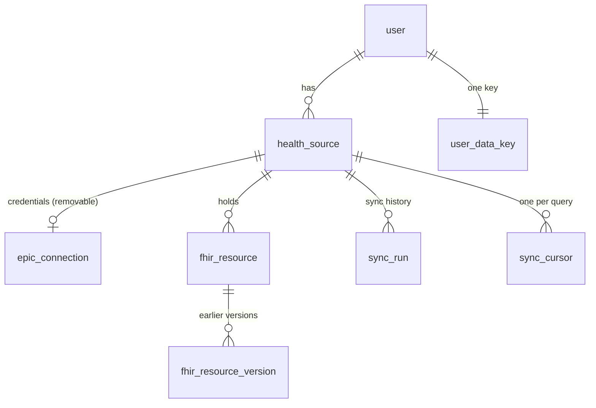
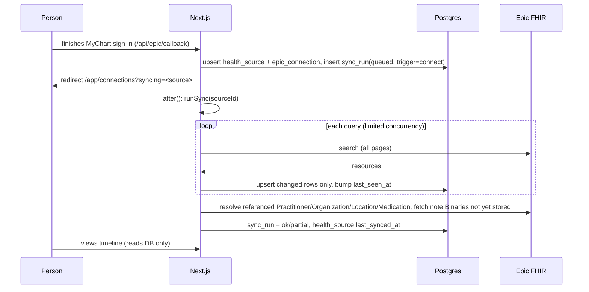

# Stored records and incremental sync: design brainstorm

**Status:** draft for discussion, 2026-09-26. Nothing here is built yet. It reverses the roadmap's "Live fetch" decision (`docs/superpowers/plans/2026-09-23-dashboard-roadmap.md`), which said storage would come after the production gate. We are still sandbox-only (`EPIC_ENVIRONMENT=sandbox`), so we can build and test storage on sample patients before any real patient data reaches it.

**Goal:** when someone connects a health system, pull everything it will share and keep it in Postgres. Later refreshes fetch again, skip what we already have, and store only new or changed records. Two pages come out of this:

1. **Connections:** every connected organization, when it last synced, what it holds, and a Refresh button.
2. **Timeline:** every stored record from every source in one list, newest first, with each row tagged by its organization.

**Why:** today `loadRecordsFor` (`src/lib/records-server.ts`) runs 18 FHIR searches per connection on every page view. That is slow, uses up Epic rate limits, and is capped at 5 pages or 200 resources per search (`src/lib/fhir/client.ts`). It also leaves nothing for later features such as history, search, export or AI summaries to build on.

---

## 1. What we store

We lean toward storing more. Anything Epic returns under the scopes we hold is kept whole, as the raw FHIR JSON, and never trimmed down to the fields the UI shows today. Normalizers already run on raw resources, so display logic can change without a re-fetch.

| Data | Today | Proposed | Notes |
| --- | --- | --- | --- |
| The 18 record queries in `RECORD_QUERIES` | Fetched live, not stored | **Store the raw resource** | The main body of data |
| More Condition categories (`encounter-diagnosis`, `health-concern`) | Not requested | **Add** | Epic splits conditions by category; today we only ask for `problem-list-item` |
| More Observation categories (`exam`, `survey`, `imaging`, `smartdata`, etc.) | Not requested | **Add** where the sandbox returns data | Must be tried against the sandbox first |
| Note text (`Binary` behind `DocumentReference`) | Fetched when "Show note" is clicked | **Store it**, fetched during sync | The most useful data for later summarizing. Store the plain text we derive *and* the original bytes (HTML/RTF), capped per note (for example 1 MB) |
| Referenced resources: `Practitioner`, `Organization`, `Location`, `Medication` | Not fetched | **Store**, resolved from references after the main pull | Turns "Practitioner/eXyz" into names and places |
| `Patient` (the person's demographics at that source) | Not fetched | **Store** | Needed later to confirm two sources are the same person, and for a profile view |
| Imaging (DICOM) | n/a | **Not possible** | Epic patient APIs don't serve images |
| Raw HTTP responses, headers, bundles | n/a | **Don't store** | Only the resources inside them |
| Sync bookkeeping (counts, durations, error codes) | Console only | **Store**, with no PHI | Powers the connections page and debugging |

New types need new scopes and Epic app settings (Practitioner.Read, Organization.Read and others). Plan on one reconnect for everyone when those scopes are added.

**Size:** a typical patient has hundreds to a few thousand resources, averaging a few KB each. Notes are larger. Plan for about 1–20 MB per user, which Postgres handles easily.

---

## 2. Data model (Postgres + Drizzle)

New file: `src/lib/db/records-schema.ts`, exported from `schema.ts`, with a migration from `npm run db:generate`.



### 2.1 Separate the *source* from its *credentials*

Today, disconnecting deletes the `epic_connection` row. If stored records hang off that row, disconnecting also deletes the records, and a token expiry that needs a reconnect could mean re-importing everything. So split them apart:

- **`health_source`**: the organization, as the person sees it. Stays until the person deletes it.
- **`epic_connection`**: the tokens, as today, plus a `source_id` foreign key. Disconnecting deletes only this row, so the tokens are gone at once. What happens to the records is the person's choice (see §5).

```ts
health_source {
  id                 uuid pk
  user_id            text fk → user.id  on delete cascade
  vendor             text   -- 'epic' (leaves room for others)
  fhir_base_url      text
  organization_name  text
  status             text   -- 'connected' | 'reconnect_required' | 'disconnected'
  last_synced_at     timestamptz null     -- last run that finished
  last_sync_status   text null            -- 'ok' | 'partial' | 'failed'
  created_at, updated_at
  unique (user_id, fhir_base_url)
}
```

The `epic_connection` unique key stays `(user_id, fhir_base_url)`, and the table gains `source_id uuid not null unique fk → health_source.id on delete cascade`.

### 2.2 `fhir_resource`: one row per resource per source

```ts
fhir_resource {
  id                  uuid pk
  user_id             text fk → user.id on delete cascade  -- repeated here so every query can filter on it
  source_id           uuid fk → health_source.id on delete cascade
  resource_type       text        -- 'Observation'
  fhir_id             text        -- resource.id at the source
  category            text null   -- our RecordCategory ('lab', 'vital', ...); null for supporting types (Practitioner, ...)
  effective_at        timestamptz null   -- the sort key for the timeline; null = undated
  date_precision      text null   -- 'year' | 'month' | 'day' | 'instant' (FHIR dates can be partial: '2019', '2019-04')
  source_version_id   text null   -- meta.versionId, when the source sends it
  source_updated_at   timestamptz null  -- meta.lastUpdated, when the source sends it
  content_hmac        text        -- HMAC-SHA256(user key, canonical JSON); detects changes when meta is missing
  sealed_resource     text        -- encrypted raw FHIR JSON
  sealed_summary      text        -- encrypted RecordSummary (title/detail/status) for fast list rendering
  normalizer_version  int         -- rebuild sealed_summary lazily when normalize.ts changes
  first_seen_at       timestamptz
  last_seen_at        timestamptz -- set on every sync that saw it
  removed_at          timestamptz null  -- missing from a full pull, or status entered-in-error
  unique (source_id, resource_type, fhir_id)
  index (user_id, effective_at desc, id)           -- the timeline
  index (user_id, category, effective_at desc, id) -- category pages
}
```

Notes:

- **The unique key is how duplicates are caught.** A resource's identity is `(source, type, FHIR id)`. Syncs upsert on that key.
- **Plaintext columns are kept to the minimum** the timeline query needs: type, category, a date and the source. Everything clinical (names, values, codes, notes) is encrypted. Even so, the plaintext columns reveal *that* someone had, say, a lab on some date at some organization. That is the accepted trade-off; see §3.
- `sealed_summary` means the timeline never has to decrypt and re-normalize every full resource just to draw a list.

### 2.3 `fhir_resource_version`: keep what changed (optional, recommended)

When a sync finds that a stored resource changed, the old sealed resource moves here before the row is updated. It is cheap and lets us show "this result was amended" later. Columns: `resource_id fk`, `sealed_resource`, `content_hmac`, `source_version_id`, `replaced_at`.

### 2.4 Note text

This can be stored on the `fhir_resource` row of the `Binary`, or in a separate `fhir_attachment` table (`resource_id`, `url`, `content_type`, `sealed_bytes`, `sealed_text`, `size`). **A separate table is recommended**, so that large blobs stay out of timeline queries.

### 2.5 Sync bookkeeping

```ts
sync_run {
  id uuid pk, source_id fk, user_id fk
  trigger      text   -- 'connect' | 'manual' | 'scheduled'
  status       text   -- 'queued' | 'running' | 'ok' | 'partial' | 'failed'
  started_at, finished_at
  stats        jsonb  -- per query: { fetched, inserted, updated, unchanged, removed, error_code }  (no PHI)
}

sync_cursor {
  source_id fk, query_key text     -- 'Observation:laboratory'
  last_success_at timestamptz      -- used for _lastUpdated if the server supports it
  last_full_at    timestamptz      -- last time the whole query was re-pulled (so removals can be detected)
  primary key (source_id, query_key)
}
```

At most one run per source can be `queued` or `running`, enforced with a partial unique index: `unique (source_id) where status in ('queued','running')`.

---

## 3. Security and privacy

### Recommendation: application-layer envelope encryption, with a key per user

| Option | What it is | Pros | Cons |
| --- | --- | --- | --- |
| A. Plaintext `jsonb` | Rely on Neon's disk encryption plus access controls | Simplest; SQL/JSON queries over clinical data | A leaked DB URL, a backup, a stray `SELECT *` or a log line exposes everything |
| **B. Encrypted blob + minimal plaintext index (recommended)** | Raw resource and summary sealed with AES-256-GCM using a per-user data key; only type, category, date and source in the clear | A DB compromise without the app key exposes very little; per-user keys allow crypto-shredding | No SQL over clinical fields. That's acceptable: per-user datasets are small, so the server can decrypt all of one person's records in memory in milliseconds when a feature needs to search them |
| C. B plus an external KMS | Per-user data keys wrapped by AWS KMS / GCP KMS instead of an env var | Key never sits in app config; access to it is audited and can be revoked | Extra service and cost; better as a later step |

Design B so that C is a drop-in change: the "unwrap user key" function is the only thing that changes.

**Details:**

- **Key hierarchy.** A new `RECORDS_ENCRYPTION_KEY` (the key-encryption key, or KEK) is kept separate from `TOKEN_ENCRYPTION_KEY`, so one leaked key doesn't expose both tokens and records. The `user_data_key` table holds `{ user_id pk, sealed_dek, kek_version, created_at }`, and each user gets a random 32-byte data key (DEK).
- **Crypto-shredding.** Deleting a user's `user_data_key` row makes their records unreadable everywhere, including in Neon point-in-time backups we can't edit. This is the honest way to honour "delete my data".
- **Bind each ciphertext to its row.** Extend `seal()` with a `v2` format that takes associated data (`user_id|source_id|resource_type|fhir_id`). A sealed blob copied onto another row, or another user's row, then fails to decrypt. The existing `v1` values keep working.
- **The HMAC, not a plain hash, for change detection.** A plain SHA-256 of a small resource could be matched against guessed values. The HMAC is keyed with a key derived from the user's DEK.
- **Access control.** Every query filters on `user_id` from the session, as `deleteConnection` already does. Postgres row-level security is worth adding as defence in depth: a `pgPolicy` on `user_id = current_setting('app.user_id')`, set per transaction. That is a phase-2 hardening item.
- **Server-only.** New modules import `server-only`. Decrypted resources reach the client only as rendered pages or server-action results for the owner, as today.
- **No PHI in logs.** Keep the current rule. `sync_run.stats` holds counts and error codes only. Log lines name the resource type and status code, never the content (see how `records.ts` logs today).
- **Audit trail (recommended).** An `audit_event` table records connect, sync, disconnect, delete-source, delete-account and export, each with user, time and source id. It holds no PHI and is useful for support and for proving that a deletion happened.
- **Retention.** Records are kept until the person deletes the source or their account. Nothing expires on its own.
- **Legal and copy.** This is not a compliance claim (see `AGENTS.md`). A consumer app holding health records is likely covered by the FTC Health Breach Notification Rule and state health-privacy laws (for example Washington's My Health My Data Act). Check this with counsel before production, and check whether Neon offers a BAA/HIPAA plan on our tier if that becomes relevant. **Copy that becomes false and must change in the same PR:**
  - `src/app/privacy/page.tsx`: "We don't save your health records in our database…"
  - `src/components/landing/Privacy.tsx`: "…and we don't store your records."
  - `src/lib/onboarding.ts`: the privacy acknowledgement text. Bump `CONSENT_VERSION` so everyone re-acknowledges.
  - The connections page footnote: "Disconnecting deletes the access we stored…"

---

## 4. Sync engine

### 4.1 Flow



### 4.2 Duplicates and "only fetch what's new"

The two halves of this have honest limits:

1. **Only *store* what's new: fully achievable.** For each fetched resource, look up `(source_id, resource_type, fhir_id)`:
   - not stored → insert;
   - stored, and `meta.versionId`/`lastUpdated` or the `content_hmac` differs → move the old version to `fhir_resource_version`, then update;
   - identical → set `last_seen_at` only (no re-encrypt, no write amplification).
   Do this in batches of about 100 with one `SELECT … WHERE (type, fhir_id) IN (…)` and one multi-row upsert.
2. **Only *fetch* what's new: depends on Epic, and must be tested in the sandbox.** FHIR's standard tool is `_lastUpdated=gt<cursor>`, but Epic's support for it varies by resource and it is not reliable for every search we run. Plan:
   - **Per query**, probe once whether `_lastUpdated` is honoured. If it is, send incremental searches from `sync_cursor.last_success_at` minus a safety overlap (for example 1 day).
   - Otherwise, **re-pull the whole query and diff it** with the logic in step 1. That still costs the network fetch, but writes are skipped and page views never touch Epic, which is the real win.
   - **Full re-pull at least weekly** per query, even where incremental works. It is the only way to notice records that disappeared (marked `removed_at` and hidden, never hard-deleted), because incremental searches don't report deletions.
   - Note binaries are immutable per URL: fetch only those whose URL isn't stored yet.
3. **Duplicates across sources** (the same vaccine recorded by two health systems through Care Everywhere) are **kept as separate rows**, each tagged with its own source. Merging is a display-time feature for later (match on code + date + value) and should never be destructive at storage time.

### 4.3 Limits and where the sync runs

- Syncing leaves the request path, so the page caps in `fhirSearch` can be raised for sync (for example 100 pages / 10k resources per query), while keeping the byte-per-page limit and the same-origin paging check.
- **Runner, v1:** `after()` from `next/server`, started from the callback route and the Refresh server action, plus the `sync_run` row as the job record. Confirm how `after` behaves in this Next version (`node_modules/next/dist/docs/`) and the Vercel function duration limit. A first full sync of a large record may exceed it. So make `runSync` **resumable**: each query commits on its own and records progress in `sync_run.stats`, and a run that died is picked up again by the next trigger.
- **Runner, v2 (if v1 hits limits):** a real queue (Vercel Queues, Inngest or QStash) with one job per (source, query).
- **Concurrency:** the partial unique index allows one active run per source. Token refresh already serializes on the `epic_connection` row lock (`accessTokenFor`).
- **Rate limiting:** manual Refresh is allowed once per source every 5 minutes, and the button shows "Synced just now".
- **Scheduled refresh (optional):** a Vercel Cron job that refreshes sources not synced in 24 hours while their refresh token is valid. Off by default in v1; see open questions.

### 4.4 Code layout

| Module | Role |
| --- | --- |
| `src/lib/db/records-schema.ts` | Tables above |
| `src/lib/crypto/user-keys.ts` | Create and unwrap per-user DEKs; `sealFor(user, aad)`, `unsealFor(...)`, `hmacFor(...)` |
| `src/lib/sync/plan.ts` | The query list (grows from `RECORD_QUERIES`), incremental vs full per query. Pure and tested |
| `src/lib/sync/diff.ts` | Classifies fetched vs stored as insert / update / unchanged / removed. Pure and tested |
| `src/lib/sync/run.ts` | `runSync(sourceId, deps)`: orchestration with injected `search`, `accessToken` and `store`, like `gatherRecords` today, so PGlite tests can drive it |
| `src/lib/records-store.ts` (server-only) | Reads: `timelinePage(userId, { cursor, sourceIds, categories })`, `recordsInCategory`, `countsBySource` |
| `src/lib/records-server.ts` | `loadRecordsFor` switches from live fetch to reading from the database |

The normalizers, `describe.ts`, `fields.ts` and `note-text.ts` are reused unchanged, because stored raw resources produce the same `RecordItem`s.

---

## 5. UX

### 5.1 Connecting (first sync)

1. The callback succeeds. We create the source and connection, queue `sync_run(trigger=connect)` and redirect to `/app/connections?syncing=…`.
2. The connections page shows the new organization with "Importing your records…" and per-category counts filling in. It polls every 2–3 s with a small client component calling a server action that returns `sync_run.stats`. No PHI goes to the client, only counts.
3. When the run finishes: "Imported 1,284 records from Northside Health." If any query failed, show it as partial: "Some record types couldn't be loaded; we'll try again on the next refresh."
4. Reconnecting an existing source (same `fhir_base_url`) reuses the same `health_source`. Its records stay put and only a sync runs.

### 5.2 Connections page (`/app/connections`, extended)

For each organization:

- Name, status chip (**Connected** / **Needs reconnect** / **Disconnected: records kept**) and a sample-data tag as today.
- "Last updated 3 hours ago", with a link to the result of the last run.
- Counts: "412 labs · 38 visits · 12 medications…"
- **Refresh**: queues a manual sync and then shows the same progress state. Disabled while a run is active or during the cooldown.
- **Reconnect**: as today, and the primary action when status is `reconnect_required`.
- **Disconnect**: removes the tokens. A confirmation asks **"Keep the records already imported?"** (default: keep) or "Delete them too".
- **Delete records from this source**: available even after disconnecting.

A "Refresh all" button at the top is worth adding once there are several sources.

### 5.3 Timeline page (`/app/timeline`, or the dashboard home itself)

- One list across every source, grouped by year as `Timeline.tsx` does today, newest first. Each row carries an **organization tag** (a colored chip per source; the `source` field already exists on `RecordSummary`).
- **Filters** (query-string driven, no JavaScript needed): organization (multi-select), category, and a date range. "Undated" records go in their own group at the end.
- **Keyset pagination** on `(effective_at, id)`: "Load older" with 100 rows per page. This replaces today's `TIMELINE_LIMIT = 60`.
- Rows expand in place with `RecordDetail` as today. The detail now decrypts only that row's resource. Stored note text shows immediately, and "Show note" is only needed for a note not yet imported.
- The header says "Last updated … · Refresh" so people know the data is a snapshot.
- Removed and entered-in-error records are hidden by default. A later "show removed" toggle is possible.

**Suggestion:** make the unified timeline the dashboard home (`/app`), since that page is already a timeline. Keep the category pages, which now read from the database.

---

## 6. Rollout

1. **Schema and crypto:** tables, migration, per-user keys, `seal` v2 with associated data. Tests on PGlite.
2. **Sync engine:** diff and plan as pure functions, `runSync` with injected dependencies, `_lastUpdated` probing. Walk through it against the Epic sandbox patients.
3. **Hook sync into connect and Refresh**, and switch reads to the database (`loadRecordsFor` → `records-store`). Live fetch goes away.
4. **Connections page** with status, counts, progress and disconnect choices.
5. **Timeline page** with source tags, filters and pagination.
6. **Store more:** extra categories, referenced resources, note binaries, Patient. This needs Epic app scope changes and one reconnect.
7. **Copy and consent:** privacy page, landing page, acknowledgement text, `CONSENT_VERSION` bump. These must ship **with step 3**, not after it.
8. **Hardening:** audit events, RLS, scheduled refresh, KMS, export as a FHIR Bundle.

Every step runs `npm run lint`, `npm run typecheck`, `npm run build` and `npm test`.

---

## 7. Open questions (decisions needed)

1. **Disconnect default:** keep the imported records (recommended, matching "store more") or delete them?
2. **Encryption level:** app-layer envelope encryption (recommended, option B) or plaintext `jsonb` for easier querying (option A)?
3. **Version history:** keep earlier versions of changed resources (recommended)?
4. **Scheduled background refresh:** only on connect and manual Refresh for now, or a nightly cron as well?
5. **Timeline location:** replace the `/app` home, or add a separate `/app/timeline`?
6. **Job runner:** start with `after()` and resumable runs (recommended), or go straight to a queue service?
7. **Scope expansion:** OK to add Practitioner/Organization/Location/Medication/Patient and extra categories, which needs an Epic app update and a reconnect?
