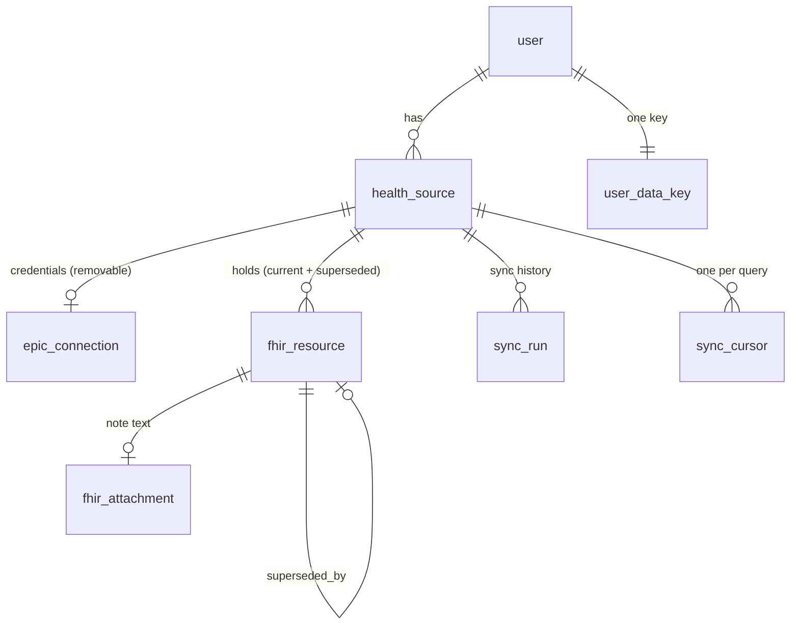
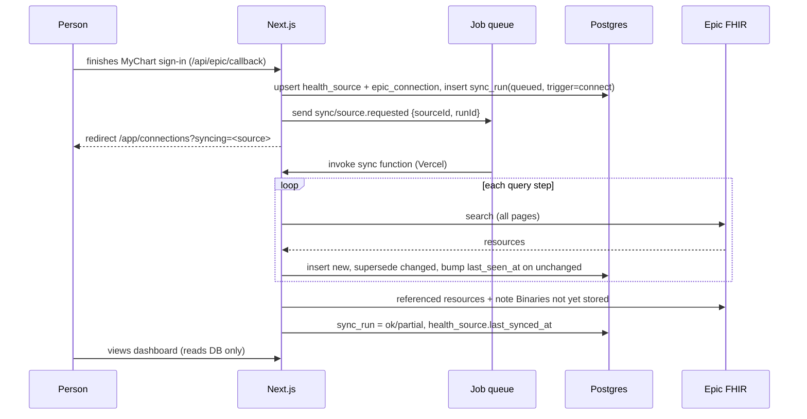

# Stored records and incremental sync: design

**Status:** decisions agreed in chat on 2026-09-26 (see §7). Nothing here is built yet. It reverses the roadmap's "Live fetch" decision (`docs/superpowers/plans/2026-09-23-dashboard-roadmap.md`), which said storage would come after the production gate. We are still sandbox-only (`EPIC_ENVIRONMENT=sandbox`), so we can build and test storage on sample patients before any real patient data reaches it.

**Goal:** when someone connects a health system, pull everything it will share and keep it in Postgres. Later refreshes, whether manual or in the background, fetch again, skip what we already have, and store only new or changed records. Two pages come out of this:

1. **Connections:** every connected organization, when it last synced, what it holds, and a Refresh button.
2. **Dashboard home (`/app`):** every stored record from every source in one timeline, newest first, with each row tagged by its organization.

**Why:** today `loadRecordsFor` (`src/lib/records-server.ts`) runs 18 FHIR searches per connection on every page view. That is slow, uses up Epic rate limits, and is capped at 5 pages or 200 resources per search (`src/lib/fhir/client.ts`). It also leaves nothing for later features such as history, search, export or AI summaries to build on.

---

## 1. What we store

We lean toward storing more. Anything Epic returns under the scopes we hold is kept whole, as the raw FHIR JSON, and never trimmed down to the fields the UI shows today. Normalizers already run on raw resources, so display logic can change without a re-fetch. We don't store raw HTTP responses, headers or bundles, only the resources inside them. Sync bookkeeping (counts, durations, error codes) is stored, with no PHI.

### 1.1 What we already have scopes for

These need no new scopes (see `EPIC_SCOPES` in `src/lib/epic/authorize.ts`):

| Data | Today | Proposed | Why |
| --- | --- | --- | --- |
| The 18 record queries in `RECORD_QUERIES` | Fetched live, not stored | **Store the raw resource** | The main body of data |
| Note text (`Binary`) | Fetched when "Show note" is clicked | **Fetched during sync and stored**: the plain text we derive plus the original bytes, capped at about 1 MB per note | Notes are the richest narrative in the record and the most useful input for later summaries. Storing them also makes opening a note instant. |
| `Patient` | Scope granted, never fetched | **Fetch and store** | Name, birth date and identifiers at each source. Needed to confirm that two sources are the same person, to flag a sample-data patient, and for a profile view. |
| Condition, more categories: `encounter-diagnosis`, `health-concern` | Only `problem-list-item` is requested | **Add searches** | Visit diagnoses ("seen for acute bronchitis") are often absent from the problem list. Health concerns capture things the care team is watching. |
| Observation, more categories: `survey` (assessments such as PHQ-9 or GAD-7), `exam`, and others the sandbox returns | Only laboratory, vital-signs and social-history | **Add searches**, each confirmed in the sandbox | Screening scores and exam findings round out the record |

The extra categories may need the matching APIs switched on in the Epic app registration (Epic lists "Condition (Encounter Diagnosis)" and similar separately), but no new OAuth scope.

### 1.2 Extra data types (these need new scopes and one reconnect)

Recommended now (tier 1):

| Type | Scope | Why |
| --- | --- | --- |
| `Medication` | `patient/Medication.rs` | Epic often sends a prescription as a *reference* to a Medication instead of inline text. Without it we can't reliably show strength, form and ingredients, which are the details that matter on a med list. |
| `Practitioner` and `PractitionerRole` | `patient/Practitioner.rs`, `patient/PractitionerRole.rs` | Turn "ordered by Practitioner/eXyz" into a name and specialty on orders, notes, visits and the care team. This is also the basis for "who's my cardiologist" style views later. |
| `Organization` and `Location` | `patient/Organization.rs`, `patient/Location.rs` | Where a visit happened. It also names the *real* originating organization for records that came in through Care Everywhere, which may differ from the organization we connected to. |
| `Appointment` | `patient/Appointment.rs` | Upcoming visits. It's the only way the timeline can show future events, and it's high value for someone managing their care. |
| `FamilyMemberHistory` | `patient/FamilyMemberHistory.rs` | Family history ("mother: breast cancer at 45") is core context for risk and for a specialist, and it isn't in any type we fetch today |

Later (tier 2, useful but lower value):

| Type | Why later |
| --- | --- |
| `QuestionnaireResponse` | Patient-entered questionnaires. Epic support varies and the content is messy. |
| `Provenance` | Exact authorship and source trail per record. Useful for trust and debugging, but not for display yet. |
| `Specimen`, `RelatedPerson`, `Consent` | Rarely useful to a patient; can be added when a feature needs them |
| `ExplanationOfBenefit` | Claims and costs. Few Epic organizations expose it to patients. |

Imaging (DICOM) is not possible: Epic's patient APIs don't serve images.

**Rollout for new scopes:** add them to `EPIC_SCOPES`, add labels to `SCOPE_LABELS`, and enable the APIs in the Epic app (sandbox first). The connections page then shows "Reconnect to add more of your record" on sources whose granted `scope` lacks them. The sync skips types it has no scope for rather than failing.

**Size:** a typical patient has hundreds to a few thousand resources, averaging a few KB each. Notes are larger. Plan for about 1–20 MB per user, which Postgres handles easily.

---

## 2. Data model (Postgres + Drizzle)

New file: `src/lib/db/records-schema.ts`, exported from `schema.ts`, with a migration from `npm run db:generate`.



### 2.1 Separate the *source* from its *credentials*

Disconnecting deletes the tokens but **keeps the records by default** (decision 1). So the organization and its records can't hang off the token row:

- **`health_source`**: the organization, as the person sees it. Stays until the person deletes it.
- **`epic_connection`**: the tokens, as today, plus a `source_id` foreign key. Disconnecting deletes only this row, so access ends at once.

```ts
health_source {
  id                 uuid pk
  user_id            text fk → user.id  on delete cascade
  vendor             text   -- 'epic' (leaves room for others)
  fhir_base_url      text
  organization_name  text
  status             text   -- 'connected' | 'reconnect_required' | 'disconnected'
  last_synced_at     timestamptz null     -- last run that finished
  last_sync_status   text null            -- 'ok' | 'partial' | 'failed'
  created_at, updated_at
  unique (user_id, fhir_base_url)
}
```

The `epic_connection` unique key stays `(user_id, fhir_base_url)`, and the table gains `source_id uuid not null unique fk → health_source.id on delete cascade`. Reconnecting an existing organization reattaches to the same `health_source`.

### 2.2 `fhir_resource`: one row per version of a resource

Earlier versions stay in the same table and are **marked superseded** (decision 3), never overwritten.

```ts
fhir_resource {
  id                  uuid pk
  user_id             text fk → user.id on delete cascade  -- repeated here so every query can filter on it
  source_id           uuid fk → health_source.id on delete cascade
  resource_type       text        -- 'Observation'
  fhir_id             text        -- resource.id at the source
  category            text null   -- our RecordCategory ('lab', 'vital', ...); null for supporting types (Practitioner, ...)
  effective_at        timestamptz null   -- the sort key for the timeline; null = undated
  date_precision      text null   -- 'year' | 'month' | 'day' | 'instant' (FHIR dates can be partial: '2019', '2019-04')
  source_version_id   text null   -- meta.versionId, when the source sends it
  source_updated_at   timestamptz null  -- meta.lastUpdated, when the source sends it
  content_hmac        text        -- HMAC-SHA256(user key, canonical JSON); detects changes when meta is missing
  sealed_resource     text        -- encrypted raw FHIR JSON
  sealed_summary      text        -- encrypted RecordSummary (title/detail/status) for fast list rendering
  normalizer_version  int         -- rebuild sealed_summary lazily when normalize.ts changes
  first_seen_at       timestamptz
  last_seen_at        timestamptz -- set on every sync that saw it
  superseded_at       timestamptz null  -- set when a newer version arrived
  superseded_by       uuid null fk → fhir_resource.id
  removed_at          timestamptz null  -- missing from a full pull, or status entered-in-error
  -- exactly one current row per resource:
  unique (source_id, resource_type, fhir_id) where superseded_at is null
  index (user_id, effective_at desc, id) where superseded_at is null and removed_at is null  -- the timeline
  index (user_id, category, effective_at desc, id) where superseded_at is null and removed_at is null
}
```

Notes:

- **The partial unique key is how duplicates are caught.** A resource's identity is `(source, type, FHIR id)`, and only one version of it is current.
- **When a resource changes,** one transaction inserts the new row, then sets `superseded_at` and `superseded_by` on the old row. The timeline shows only current rows. A record's detail view can say "Amended on {date}" and list its earlier versions.
- **Plaintext columns are kept to the minimum** the timeline query needs: type, category, a date and the source. Everything clinical is encrypted. The plaintext columns still reveal *that* someone had, say, a lab on some date at some organization. That is the accepted trade-off; see §3.
- `sealed_summary` means the timeline never has to decrypt and re-normalize every full resource just to draw a list.

### 2.3 `fhir_attachment`: note text

```ts
fhir_attachment {
  id uuid pk, user_id fk, source_id fk
  resource_id   uuid fk → fhir_resource.id on delete cascade   -- the DocumentReference
  url           text      -- the Binary address within the source; unique per source
  content_type  text
  size          int
  sealed_text   text      -- plain text from note-text.ts
  sealed_bytes  text null -- original HTML/RTF, capped
  fetched_at    timestamptz
  unique (source_id, url)
}
```

This lives in its own table so that large blobs stay out of timeline queries. Binaries don't change per URL, so each one is fetched once.

### 2.4 Sync bookkeeping

```ts
sync_run {
  id uuid pk, source_id fk, user_id fk
  trigger      text   -- 'connect' | 'manual' | 'scheduled'
  status       text   -- 'queued' | 'running' | 'ok' | 'partial' | 'failed'
  started_at, finished_at
  stats        jsonb  -- per query: { fetched, inserted, superseded, unchanged, removed, error_code }  (no PHI)
}

sync_cursor {
  source_id fk, query_key text     -- 'Observation:laboratory'
  last_success_at timestamptz      -- used for _lastUpdated if the server supports it
  last_full_at    timestamptz      -- last time the whole query was re-pulled (so removals can be detected)
  primary key (source_id, query_key)
}
```

At most one run per source can be `queued` or `running`, enforced with a partial unique index: `unique (source_id) where status in ('queued','running')`.

---

## 3. Security and privacy

### Decision: application-layer envelope encryption, with a key per user

| Option | What it is | Pros | Cons |
| --- | --- | --- | --- |
| A. Plaintext `jsonb` | Rely on Neon's disk encryption plus access controls | Simplest; SQL/JSON queries over clinical data | A leaked DB URL, a backup, a stray `SELECT *` or a log line exposes everything |
| **B. Encrypted blob + minimal plaintext index (chosen)** | Raw resource and summary sealed with AES-256-GCM using a per-user data key; only type, category, date and source in the clear | A DB compromise without the app key exposes very little; per-user keys allow crypto-shredding | No SQL over clinical fields. That's acceptable: per-user datasets are small, so the server can decrypt all of one person's records in memory in milliseconds when a feature needs to search them |
| C. B plus an external KMS | Per-user data keys wrapped by AWS KMS / GCP KMS instead of an env var | Key never sits in app config; access to it is audited and can be revoked | Extra service and cost; a later step |

B is designed so that C is a drop-in change: the "unwrap user key" function is the only thing that changes.

**Details:**

- **Key hierarchy.** A new `RECORDS_ENCRYPTION_KEY` (the key-encryption key, or KEK) is kept separate from `TOKEN_ENCRYPTION_KEY`, so one leaked key doesn't expose both tokens and records. The `user_data_key` table holds `{ user_id pk, sealed_dek, kek_version, created_at }`, and each user gets a random 32-byte data key (DEK).
- **Crypto-shredding.** Deleting a user's `user_data_key` row makes their records unreadable everywhere, including in Neon point-in-time backups we can't edit. This is the honest way to honour "delete my data".
- **Bind each ciphertext to its row.** Extend `seal()` with a `v2` format that takes associated data (`user_id|source_id|resource_type|fhir_id|row id`). A sealed blob copied onto another row, or another user's row, then fails to decrypt. The existing `v1` values keep working.
- **The HMAC, not a plain hash, for change detection.** A plain SHA-256 of a small resource could be matched against guessed values. The HMAC is keyed with a key derived from the user's DEK.
- **Access control.** Every query filters on `user_id` from the session, as `deleteConnection` already does. Postgres row-level security is worth adding as defence in depth: a `pgPolicy` on `user_id = current_setting('app.user_id')`, set per transaction. That is a hardening item.
- **Job queue payloads carry IDs only** (`sourceId`, `runId`), never tokens or health data. The queue vendor never sees PHI; workers load everything from our database.
- **Server-only.** New modules import `server-only`. Decrypted resources reach the client only as rendered pages or server-action results for the owner, as today.
- **No PHI in logs.** Keep the current rule. `sync_run.stats` holds counts and error codes only. Log lines name the resource type and status code, never the content.
- **Audit trail.** An `audit_event` table records connect, sync, disconnect, delete-source, delete-account and export, each with user, time and source id. It holds no PHI.
- **Retention.** Records are kept until the person deletes the source or their account, including after disconnecting. Nothing expires on its own.
- **Legal and copy.** This is not a compliance claim (see `AGENTS.md`). A consumer app holding health records is likely covered by the FTC Health Breach Notification Rule and state health-privacy laws (for example Washington's My Health My Data Act). Check this with counsel before production, and check whether Neon and the queue vendor offer a BAA/HIPAA plan if that becomes relevant. **Copy that becomes false and must change in the same release:**
  - `src/app/privacy/page.tsx`: "We don't save your health records in our database…". Also add the queue vendor under "Services we use".
  - `src/components/landing/Privacy.tsx`: "…and we don't store your records."
  - `src/lib/onboarding.ts`: the privacy acknowledgement text. Bump `CONSENT_VERSION` so everyone re-acknowledges.
  - The connections page footnote: "Disconnecting deletes the access we stored…"

---

## 4. Sync engine

### 4.1 Job queue (decision 6)

The sync runs on a job queue, not on the request path.

**Recommended vendor: Inngest.** It runs our code as ordinary Vercel functions, so health data stays on Vercel and Neon. Each step is durable and retried on its own, which gives us resumability for free when a large first import exceeds a function's time limit. Cron triggers are built in, and there's a concurrency key (one run per source). **Alternatives:** Vercel Queues, if it is generally available on our plan by the time we build (one fewer vendor), or Upstash QStash (simpler, but we'd write the step and resume logic ourselves).

Job shape (one function, several durable steps):

```
sync/source.requested { sourceId, runId, trigger }
  step "token"      → fresh access token (existing accessTokenFor; tokens never enter the queue)
  step "q:<key>"    → one step per query in the plan: fetch all pages, diff, write, record stats
  step "refs"       → resolve referenced Practitioner/Organization/Location/Medication not yet stored
  step "notes"      → fetch Binaries whose URL isn't in fhir_attachment
  step "finish"     → sync_run status, health_source.last_synced_at
concurrency: key = sourceId, limit 1;  per-organization throttle to respect Epic rate limits
```

### 4.2 Flow



### 4.3 Background refresh (decision 4: in scope, because the queue makes it easy)

- A nightly cron function selects sources with `status = 'connected'` that haven't synced in 24 hours, and sends one `sync/source.requested` per source with `trigger = 'scheduled'`. Sends are spread across a window so all sources don't hit Epic at once.
- **It depends on refresh tokens.** Epic refresh tokens expire. When a refresh fails with `ReconnectRequiredError`, the source moves to `reconnect_required` and the connections page asks the person to reconnect. Background sync stops for that source until they do.
- The scheduled job uses the same function, dedupe and limits as manual refresh, so it adds no new sync code.

### 4.4 Duplicates and "only fetch what's new"

1. **Only *store* what's new: fully achievable.** For each fetched resource, look up the current row for `(source_id, resource_type, fhir_id)`:
   - no current row → insert;
   - current row, and `meta.versionId`/`lastUpdated` or the `content_hmac` differs → insert the new version and mark the old one superseded, in one transaction;
   - identical → set `last_seen_at` only (no re-encrypt, no write amplification).
   Do this in batches of about 100 with one `SELECT … WHERE (type, fhir_id) IN (…)` and one multi-row write.
2. **Only *fetch* what's new: depends on Epic, and must be tested in the sandbox.** FHIR's standard tool is `_lastUpdated=gt<cursor>`, but Epic's support for it varies by resource.
   - **Per query**, probe once whether `_lastUpdated` is honoured. If it is, send incremental searches from `sync_cursor.last_success_at` minus a safety overlap (for example 1 day).
   - Otherwise, **re-pull the whole query and diff it** with the logic in step 1. That still costs the network fetch, but writes are skipped and page views never touch Epic.
   - **Full re-pull at least weekly** per query, even where incremental works. It is the only way to notice records that disappeared, which are marked `removed_at` and hidden, never hard-deleted.
   - Binaries are fetched once per URL.
3. **Duplicates across sources** (the same vaccine recorded by two health systems through Care Everywhere) are **kept as separate rows**, each tagged with its own source. Merging is a display-time feature for later (match on code + date + value) and is never destructive at storage time.

### 4.5 Limits

- Syncing leaves the request path, so the page caps in `fhirSearch` can be raised for sync (for example 100 pages / 10k resources per query), while keeping the byte-per-page limit and the same-origin paging check.
- **Manual Refresh** is allowed once per source every 5 minutes. The queue's concurrency key also rejects a second run while one is active.
- Token refresh already serializes on the `epic_connection` row lock (`accessTokenFor`).

### 4.6 Code layout

| Module | Role |
| --- | --- |
| `src/lib/db/records-schema.ts` | Tables above |
| `src/lib/crypto/user-keys.ts` | Create and unwrap per-user DEKs; `sealFor(user, aad)`, `unsealFor(...)`, `hmacFor(...)` |
| `src/lib/sync/plan.ts` | The query list (grows from `RECORD_QUERIES`), filtered by the source's granted scopes; incremental vs full per query. Pure and tested |
| `src/lib/sync/diff.ts` | Classifies fetched vs stored as insert / supersede / unchanged / removed. Pure and tested |
| `src/lib/sync/run.ts` | Per-step functions with injected `search`, `accessToken` and `store`, like `gatherRecords` today, so PGlite tests can drive them without the queue |
| `src/lib/sync/queue.ts` + `src/app/api/queue/route.ts` | Queue client, the sync function, the nightly cron function, and the webhook route with signature verification |
| `src/lib/records-store.ts` (server-only) | Reads: `timelinePage(userId, { cursor, sourceIds, categories })`, `recordsInCategory`, `countsBySource`, `versionsOf(resourceId)` |
| `src/lib/records-server.ts` | `loadRecordsFor` switches from live fetch to reading from the database |

The normalizers, `describe.ts`, `fields.ts` and `note-text.ts` are reused unchanged, because stored raw resources produce the same `RecordItem`s.

---

## 5. UX

### 5.1 Connecting (first sync)

1. The callback succeeds. We create the source and connection, queue the sync with `trigger=connect`, and redirect to `/app/connections?syncing=…`.
2. The connections page shows the new organization with "Importing your records…" and per-category counts filling in. It polls every 2–3 s with a small client component calling a server action that returns `sync_run.stats`. Only counts go to the client, never PHI.
3. When the run finishes: "Imported 1,284 records from Northside Health." If any query failed, show it as partial: "Some record types couldn't be loaded; we'll try again on the next refresh."
4. Reconnecting an existing organization reuses its `health_source`. The records stay, and only an incremental sync runs.

### 5.2 Connections page (`/app/connections`, extended)

For each organization:

- Name, status chip (**Connected** / **Needs reconnect** / **Disconnected: records kept**) and a sample-data tag as today.
- "Last updated 3 hours ago (automatically)", with a link to the result of the last run.
- Counts: "412 labs · 38 visits · 12 medications…"
- **Refresh**: queues a manual sync, then shows the same progress state. Disabled while a run is active or during the cooldown.
- **Reconnect**: as today. It is the primary action when status is `reconnect_required`, or when new scopes are available ("Reconnect to add more of your record").
- **Disconnect**: removes the tokens and keeps the records by default. The confirmation offers "Also delete records from this organization".
- **Delete records from this organization**: available even after disconnecting.

There is also a "Refresh all" button at the top.

### 5.3 Dashboard home (`/app`) becomes the unified timeline (decision 5)

The home page is *already* a merged timeline across organizations, grouped by year, and each row says "From {organization}". But it is fetched live and capped at the newest 60 dated records. Changes:

- It **reads from the database**, so it loads instantly and shows everything instead of 60 records.
- The **organization tag** becomes a colored chip per source, consistent across the app, in place of the plain "From …" text.
- **Filters** (query-string driven, no JavaScript needed): organization (multi-select), category, and a date range. The category summary chips stay at the top and act as the category filter.
- **Keyset pagination** on `(effective_at, id)`: "Load older" with 100 rows per page. Undated records go in their own group at the end.
- **Future appointments** (once `Appointment` is stored) go in an "Upcoming" group above today.
- Rows expand in place with `RecordDetail` as today. The detail decrypts only that row's resource. Stored note text shows immediately. Amended records show "Amended on {date} · see earlier versions".
- The header says "Last updated … · Refresh" so people know the data is a snapshot.
- Removed and entered-in-error records are hidden.

The category pages (`/app/records/[category]`) stay and read from the database too.

---

## 6. Rollout

1. **Schema and crypto:** tables, migration, per-user keys, `seal` v2 with associated data. Tests on PGlite.
2. **Sync engine:** plan and diff as pure functions, step functions with injected dependencies, `_lastUpdated` probing. Walk through it against the Epic sandbox patients.
3. **Queue:** vendor setup, the sync function, and hooking it to connect and Refresh. Switch reads to the database (`loadRecordsFor` → `records-store`) and remove live fetch. **Copy and consent changes ship in this same step**: privacy page, landing page, acknowledgement text, `CONSENT_VERSION` bump, and the new vendor.
4. **Connections page:** status, counts, progress, disconnect-and-keep.
5. **Dashboard home:** source chips, filters, pagination, amended-record history.
6. **Background refresh:** the nightly cron.
7. **Store more, part 1 (no new scopes):** Patient, note binaries, the extra Condition and Observation categories.
8. **Store more, part 2 (new scopes):** Medication, Practitioner and PractitionerRole, Organization, Location, Appointment, FamilyMemberHistory. This needs the Epic app update and the reconnect prompt.
9. **Hardening:** audit events, RLS, KMS, export as a FHIR Bundle.

Every step runs `npm run lint`, `npm run typecheck`, `npm run build` and `npm test`.

---

## 7. Decisions

| # | Question | Decision |
| --- | --- | --- |
| 1 | Disconnect default | Keep imported records; deleting them is an explicit extra choice |
| 2 | Encryption | Option B: per-user envelope encryption with minimal plaintext index columns |
| 3 | Version history | Keep earlier versions as rows marked superseded |
| 4 | Background refresh | In scope: a nightly cron on the job queue |
| 5 | Timeline location | Replace the `/app` home with the stored, filterable timeline |
| 6 | Job runner | Job queue; Inngest recommended (see §4.1) |
| 7 | Extra data types | Tier 1 in §1.2 recommended; awaiting confirmation |

**Still open:**

- Queue vendor: confirm Inngest, or prefer Vercel Queues or QStash.
- Confirm the tier 1 data types, and that one reconnect per user is acceptable.
